# Web Analysis Agent - 아키텍처 다이어그램

> GitHub에서 바로 렌더링됨. PNG export는 [mermaid.live](https://mermaid.live)에서 가능

---

## 🎯 High-Level Overview

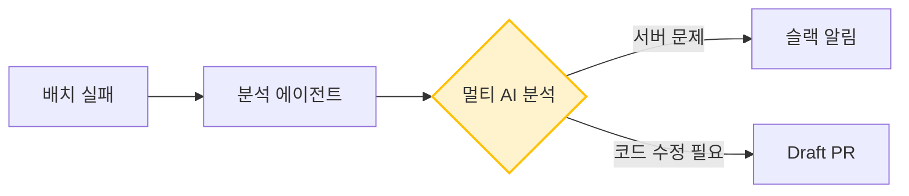

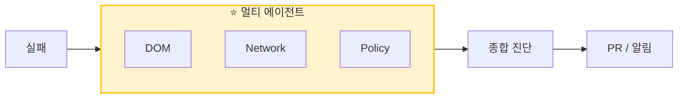

## 🔄 핵심 사이클

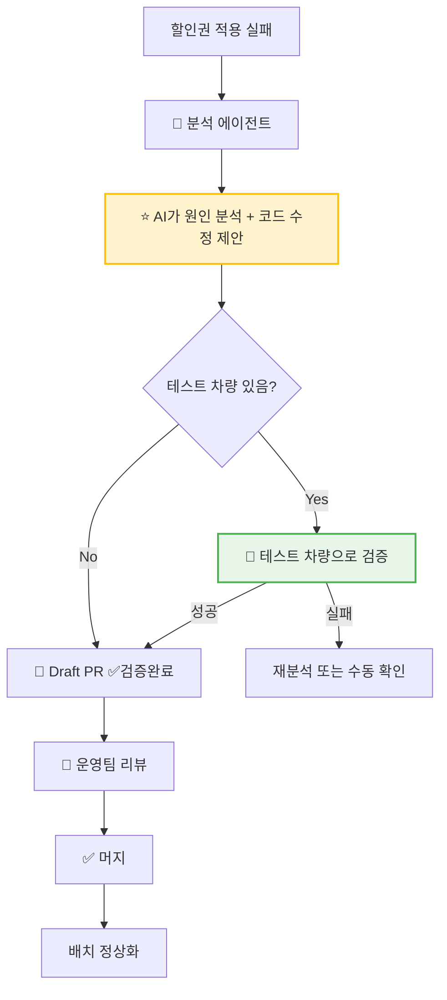

## 🤖 멀티 에이전트 구조

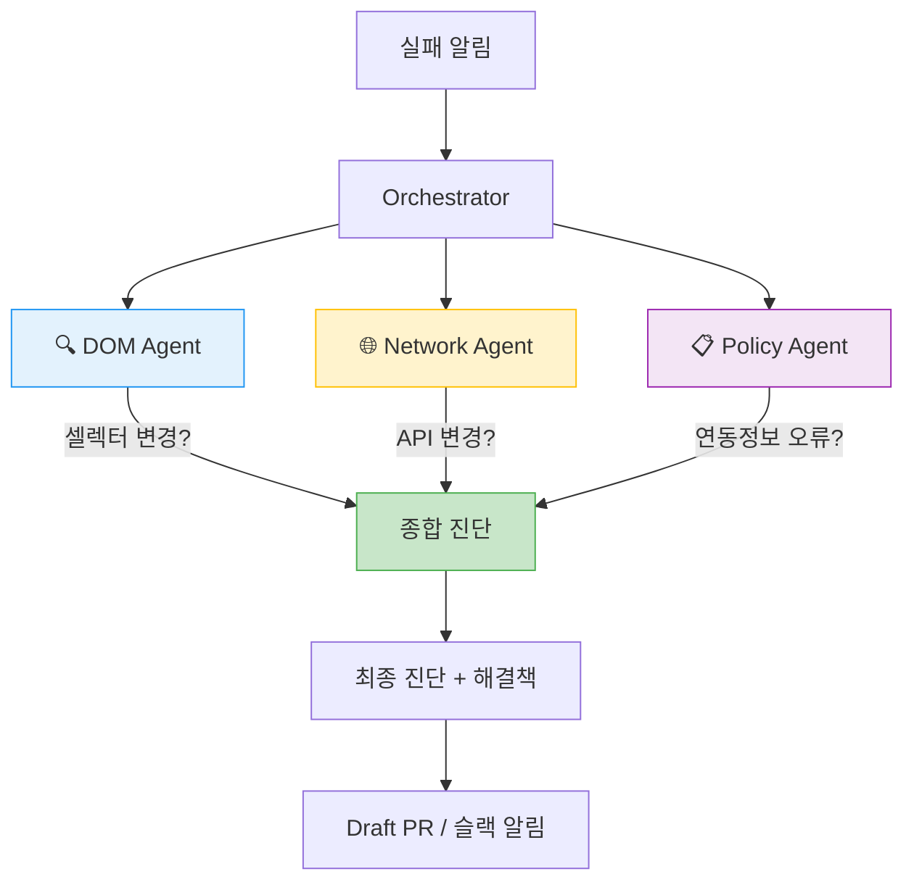

## 🚗 테스트 차량 검증

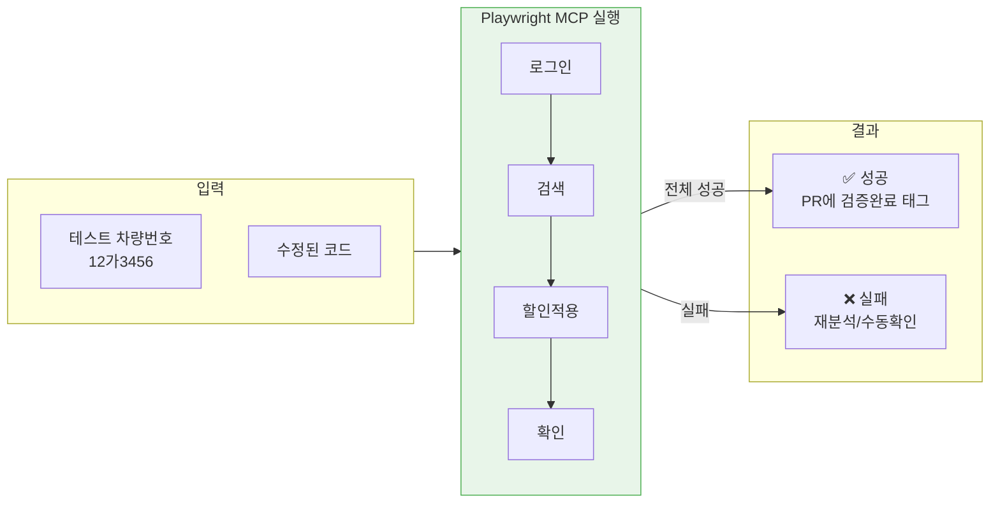

## 💡 안정성 제안 기능

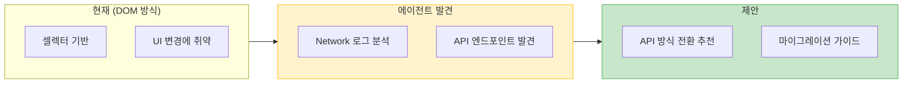

## 📊 에이전트별 역할

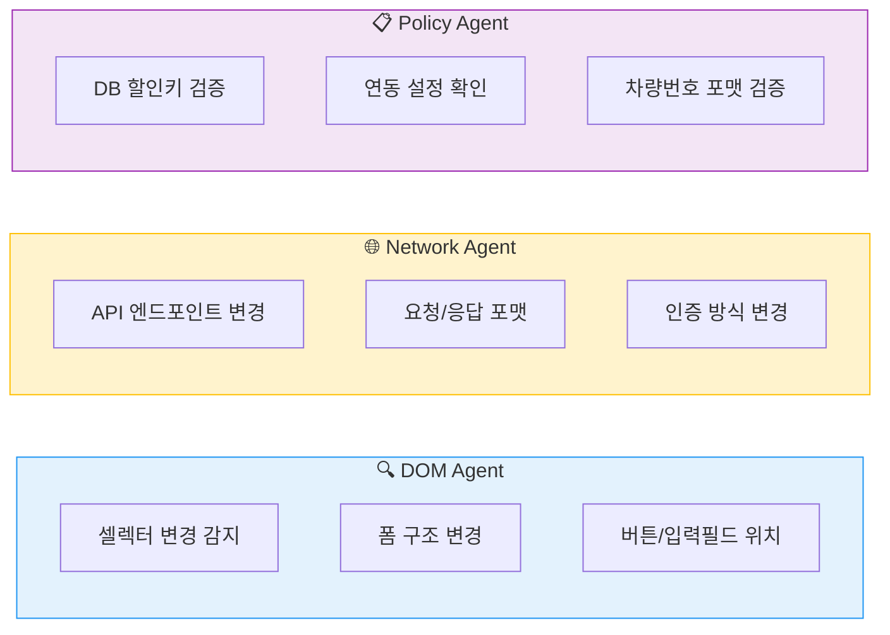

## 📂 Spec 하이브리드 조회

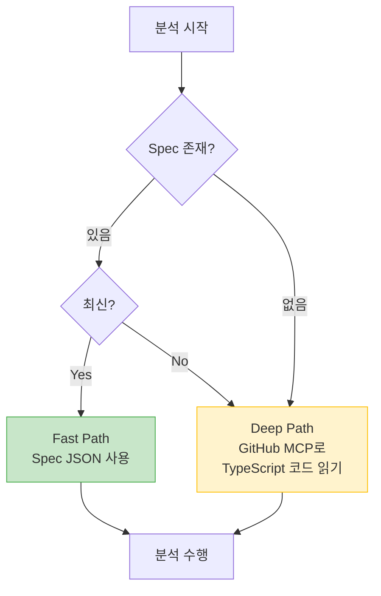

## 🔄 Spec 동기화

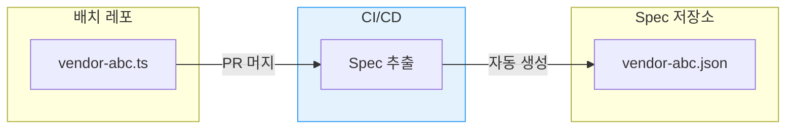

---

## 전체 흐름

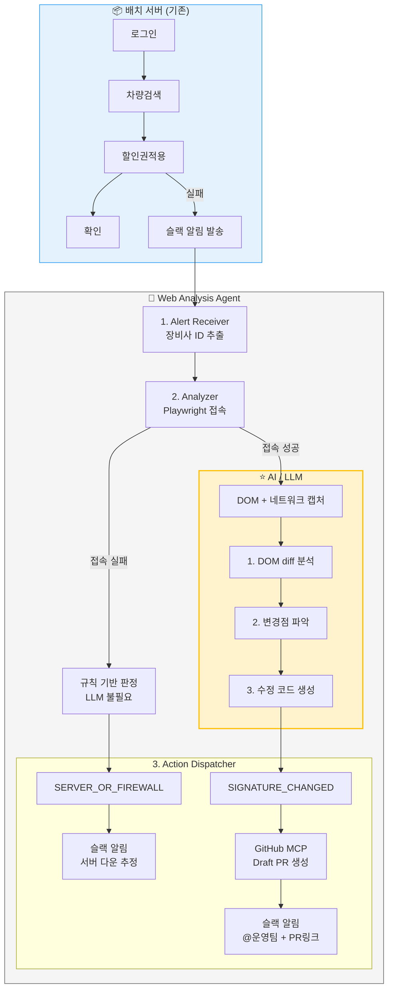

## AI 역할 상세

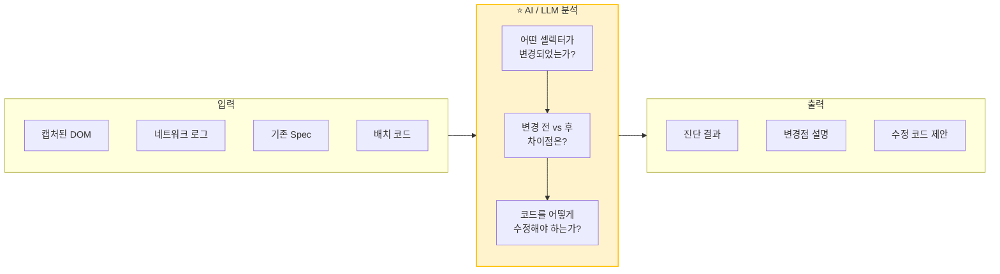

## 진단 분기

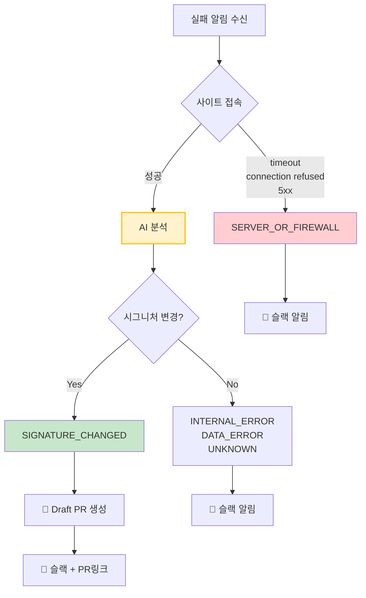

## 핵심 흐름 (간단 버전)

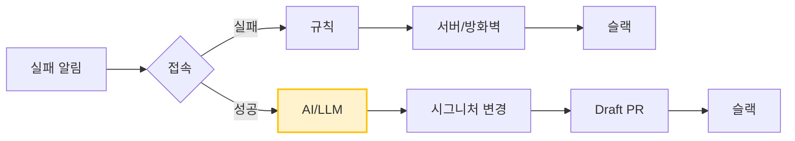
